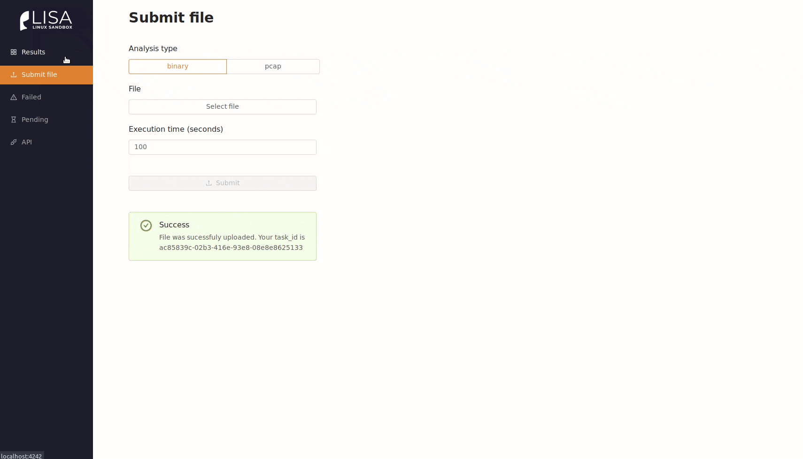

<p>
    
</p>

Project providing automated Linux malware analysis on various CPU architectures.

**Table of contents**

- [Features](#features)
- [Get Started](#get-started)
- [Configuration](#configuration)
  - [Web hosting](#web-hosting)
  - [Scaling](#scaling)
  - [VPN](#vpn)
  - [Blacklists](#blacklists)
- [Adding new sub-analysis modules](#adding-new-sub-analysis-modules)
- [Upcoming features](#upcoming-features)
- [Contribute](#contribute)
- [Related work](#related-work)
- [License](#license)



## Features

- QEMU emulation.
- Currently supporting x86_64, i386, arm, mips, aarch64.
- Small images built w/ [buildroot](https://buildroot.org/).
- Radare2 based static analysis.
- Dynamic (behavioral) analysis using SystemTap kernel modules - captured syscalls, openfiles, process trees.
- Network statistics and analysis of DNS, HTTP, Telnet and IRC communication.
- Endpoints analysis and blacklists configuration.
- Scaled with celery and RabbitMQ.
- REST API | frontend.
- Extensible through sub-analysis modules and custom images.

## Get Started

**Requirements**

- [Docker](https://docs.docker.com/install/)
- [docker-compose](https://docs.docker.com/compose/install/)

1. Get repository.

```
$ git clone https://github.com/danieluhricek/lisa
$ cd lisa
```

2. Build.

```
# docker-compose build
```

3. Run the sandbox (default location: http://localhost:4242).

```
# docker-compose up
```

## Configuration

### MaxMind GeoLite2

[Sign up](https://www.maxmind.com/en/geolite2/signup) to get your API key. Use API key in docker-compose.yml build args section.

```
.
.
  worker:
    image: lisa-worker
    build:
      context: .
      dockerfile: ./docker/worker/Dockerfile
      args:
        maxmind_key: YOUR_KEY
    volumes:
      - "./data/storage:/home/lisa/data/storage"
      .
      .
      .
.
.
```

### Web hosting

Setup your server's IP:port in nginx service in docker-compose.yml.

```
.
.
  nginx:
    image: lisa-nginx
    build:
      context: .
      dockerfile: ./docker/nginx/Dockerfile
      args:
        webhost: <myip|default=localhost>:<port>
    ports:
      - <port>:80
.
.
```

### Scaling

Workers are scalable.

```
# docker-compose up --scale worker=10
```

### VPN

You can route malware's traffic through OpenVPN. In order to do that:

1. Mount volume containing OpenVPN config (named config.ovpn).
2. Set environment valirable `VPN` to OpenVPN config's directory path.

```
.
.
  worker:
    image: lisa-worker
    build:
      context: .
      dockerfile: ./docker/worker/Dockerfile
    environment:
      - VPN=/vpn
    volumes:
      - "./data/storage:/home/lisa/data/storage"
      - "./vpn:/vpn"
.
.
```

### Blacklists

Default used blacklists are ([source](https://github.com/firehol/blocklist-ipsets)):

- bi_ssh_2_30d.ipset
- firehol_level3.netset
- firehol_webserver.netset
- iblocklist_abuse_zeus.netset
- normshield_all_wannacry.ipset

If you want to use any other blacklist, put .ipset or .netset files into `data/blacklists`. All of these blacklists are merged during build of `worker` service.

## Adding new sub-analysis modules

Core of LiSa project supports 4 basic modules of analysis: `static_analysis`, `dynamic_analysis`, `network_analysis` and `virustotal`.
Sub-analysis modules are plugin-based. For adding new sub-analysis and appending it's output to final json do following:

1. Create class which inherits from `AbstractSubAnalyzer` class and implement `run_analysis()` method eg.:

```python
class NewSubAnalyzer(AbstractSubAnalyzer):
    def run_analysis(self):
        pass
```

2. Update list in `lisa.config.py` :

```python
analyzers_config = [
    # core analyzers
    'lisa.analysis.static_analysis.StaticAnalyzer',
    'lisa.analysis.dynamic_analysis.DynamicAnalyzer',
    'lisa.analysis.network_analysis.NetworkAnalyzer',
    'lisa.analysis.virustotal.VirusTotalAnalyzer',

    # custom
    'module_of_new_analyzer.NewSubAnalyzer'
]

```

## Running tests

```
# docker build -f ./docker/tests/Dockerfile -t lisa-tests .
# docker run lisa-tests
```

## Upcoming features

1. **YARA module** - YARA module to match patterns in LiSa's JSON output.
2. **Images selection** - More Linux images containing e.g. IoT firmware.

## Contribute

Contributions | feedback | issues | pull requests are welcome.

## Related work

- [LiSa - Multiplatform Linux Sandbox for Analyzing IoT Malware](http://excel.fit.vutbr.cz/submissions/2019/058/58.pdf)
- [Understanding Linux Malware](http://www.s3.eurecom.fr/~yanick/publications/2018_oakland_linuxmalware.pdf)
- [LiSa. Linux Sand Box with Chad Seaman and Johnathan Respeto](https://www.youtube.com/watch?v=qed7ZnnkxZM)

## License

LiSa is licensed under [Apache License 2.0](LICENSE).
